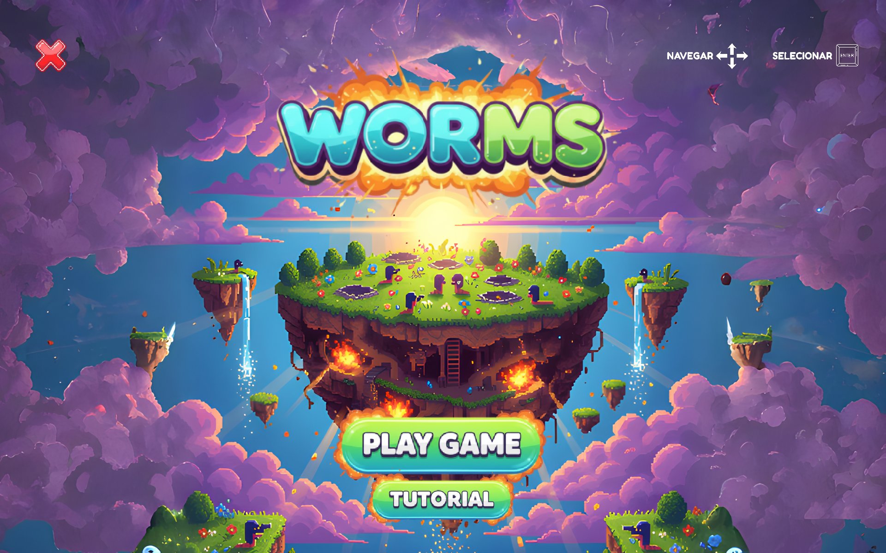

# WORMS - Turn-Based Strategy Game Engine

> Academic project developed for **Laboratórios de Informática I** @ University of Minho  
> Final grade: **17/20** ⭐



## About

This project implements a turn-based strategy game inspired by the classic **Worms** series, developed entirely in **Haskell** using functional programming principles. Players control worms equipped with weapons and must eliminate enemy worms before being eliminated themselves.

The project was developed across multiple tasks, covering game state modelling, physics simulation, entity movement, weapon logic and a fully interactive graphical interface.

## Features

- 🐛 **Turn-based gameplay** - alternating turns between teams of worms
- 💣 **Weapon system** - multiple weapons with different mechanics
- 🌍 **Physics simulation** - gravity, movement and collision detection
- 🗺️ **Map generation** - dynamic terrain with destructible elements
- 🖥️ **Graphical interface** - full visual rendering with Gloss
- 🧪 **Unit tests** - test suite with per-task feedback executables
- 📊 **Code coverage** - coverage analysis via HPC

## How to Run

```bash
# Run the game
cabal run worms-game

# Run tests for a specific task (e.g. Task 1)
cabal run t1-feedback

# Open the Haskell interpreter
cabal repl
```

## Code Coverage

```bash
cabal clean
cabal run --enable-coverage t1-feedback
./runhpc.sh t1-feedback

# Or alternatively
./runcoverage.sh t1
```

## Documentation

Generate project documentation with Haddock:

```bash
cabal haddock-project
```

## Code Quality

Analyse code quality with homplexity:

```bash
cabal install homplexity --flags="html"
homplexity-cli --format=HTML lib/ > homplexity.html
```

## Tech Stack

Haskell · Functional Programming · Gloss · Cabal · HPC · Haddock

## Authors

Carolina Dias — [@carolinavdias](https://github.com/carolinavdias)  
Leonor Sousa  

BSc Computer Engineering · University of Minho 